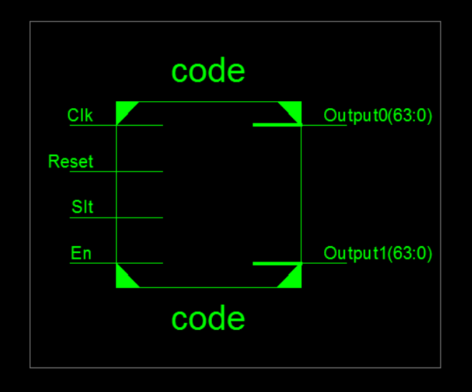
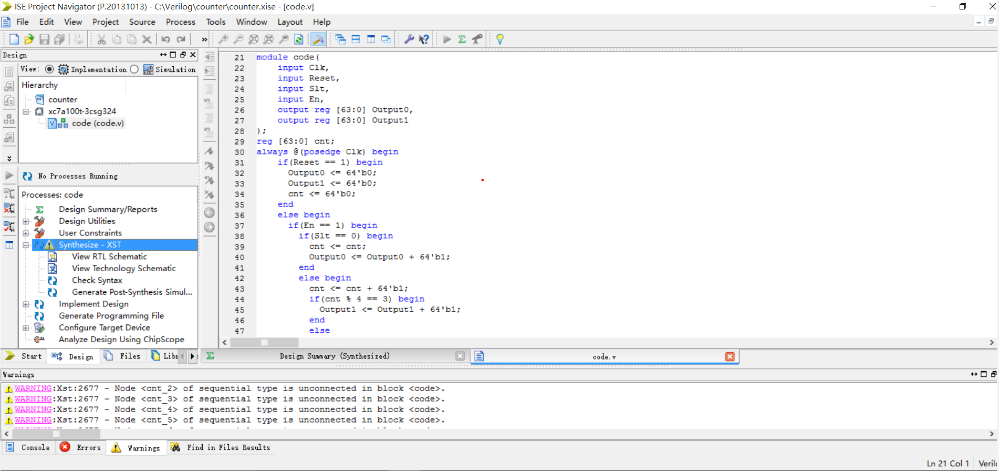

# 简单计数器
|端口|位宽|方向|描述|
|----|----|----|----|
|Clk|1|I|时钟信号|
|Reset|1|I|复位信号|
|Slt|1|I|选择信号|
|En|1|I|使能信号|
|Output0|64|O|计数器0当前值|
|Output1|64|O|计数器1当前值|
实现的功能：
1. 在任意一个时钟上升沿到来的时候，如果复位信号有效，则将两个计数器同时清零；
2. 每个时钟上升沿到来的时候，如果使能信号有效，则称其为一个“有效时钟周期”，如果：
   - 选择信号为0，则将这个有效时钟信号计入计数器0，每经过1个属于计数器0的有效时钟周期，计数器0累加1；
   - 选择信号为1，则将这个有效时钟信号计入计数器1，每经过4个属于计数器1的有效时钟周期，计数器1累加1；
3. 在满足1时，即使2的条件满足，也不必执行2；
4. 注意：复位操作也会复位每个计数器当前的有效时钟周期；初始时每个计数器的值都为 0。
******
## 思路1
使用一个integer变量cnt来储存计数器1的有效时钟信号，当cnt%4==0时将计数器1累加1,我根据此思路写出了counter.v，并成功通过了仿真测试。

#### 仿真成功但综合时出现Warning

WARNING:Xst:1710 - FF/Latch <cnt_31> (without init value) has a constant value of 0 in block \<code>. This FF/Latch will be trimmed during the optimization process.  
WARNING:Xst:1895 - Due to other FF/Latch trimming, FF/Latch \<cnt_30> (without init value) has a constant value of 0 in block \<code>. This FF/Latch will be trimmed during the optimization process.

上网查询后，发现这是因为带有integer变量的代码是不可综合的，需要将其转化为reg型变量。

#### 综合结果
  
****
##思路2

用reg [63:0] cnt替代integer变量，并且由于非阻塞赋值的特点，如下代码要进行修改
```Verilog
      if(En == 1) begin
        if(Slt == 0)
        Output0 <= Output0 + 64'b1;
        else begin
          cnt <= cnt + 64'b1;//此步骤在cnt%4后执行
          if(cnt[1:0] == 2'b11) begin//思路1为==0，非阻塞赋值使用的是未+1的cnt
            Output1 <= Output1 + 64'b1;
          end          
          else
          Output1 <= Output1;
        end
``` 
### 综合时同样出现Warning

WARNING:Xst:2677 - Node \<cnt_33> of sequential type is unconnected in block \<code>.

WARNING:Xst:2677 - Node \<cnt_34> of sequential type is unconnected in block \<code>.

但似乎可以忽略？

  
询问助教后得知，因为cnt只有后两位有用，其他位未连接，所以出现报错

### 再次更改

将cnt定义为位宽为2位的寄存器，问题解决

  
