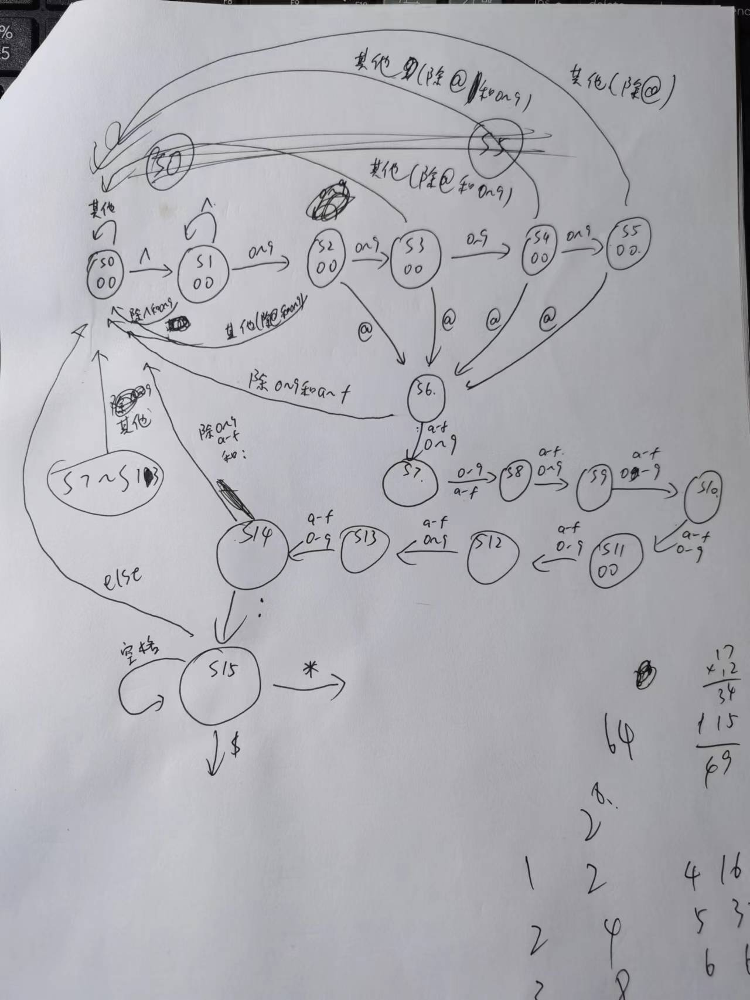
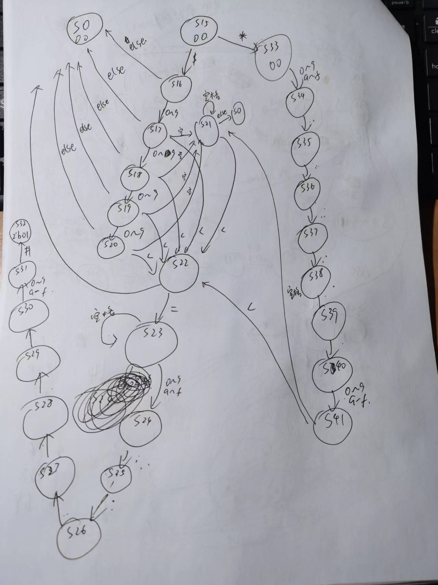

# CPU输出格式检查

在后面使用 Verilog 搭建 CPU 的实验中，我们需要对 CPU 的正确性检查，方法是对控制台输出的寄存器写入信息、数据存储器写入信息进行比对。

两种信息的格式分别为：

- **寄存器信息**：<仿真时间>@<程序计数器地址>: \$<寄存器编号> <= <写入数据>，如`42@00003004: $28 <= ff00ff00`
- **数据存储器信息**：<仿真时间>@<程序计数器地址>: *<数据存储器地址> <= <写入数据>，如`1746@00003704: *00000018 <= 69b5cca3`

进行一下易理解的简化\*\*（对其中一些数进行了命名，在Challenge部分会使用到）\*\*，且为了降低难度，在前后加入限定字符\^与\#。

- 寄存器信息序列：
  <字符'^'><十进制数time><字符'@'><8位十六进制数pc><字符':'><0个或若干空格><字符'$'><十进制数grf><0个或若干空格><字符'<'加'='><0个或若干空格><8位十六进制数data><字符'#'>
  - `^66@0000301c: $1 <= 1e1f831e#`
  - `^242@000030f4: $31 <= 19260817#`
- 数据存储器信息序列：
  <字符'^'><十进制数time><字符'@'><8位十六进制数pc><字符':'><0个或若干空格><字符'*'><8位十六进制数addr><0个或若干空格><字符'<'加'='><0个或若干空格><8位十六进制数data><字符'#'>
  - `^338@00003130: *00000088 <= ffffb528#`
  - `^7836@000030f4: *00002ffc<=19521025#`

现要求你用Moore型有限状态机检查上述两种字符串输入，**当序列的一个后缀满足格式时，将相应匹配信号置位一个时钟周期。**

对于上面所有已命名的**无符号数**：
- 十进制数至少有1位，且不允许超过4位。
- 十六进制数必须为 8 位，且使用小写字母 a ~ f 表示 10 ~ 15。

## 顶层模块定义

|端口名称|方向|位宽|描述|
|----|----|----|----|
|clk|I|1|时钟信号|
|reset|I|1|同步复位信号，将当前状态机状态回归初值并复位输出|
|char|I|8|输入的字符流，以ASCll值表示|
|format_type|O|2|2'b00:格式错误;2'b01:检测到寄存器信息序列; 2'b10:检测到数据存储信息序列|
## 补充说明
- 每个时钟上升沿执行字符识别，状态转移，并更新输出。
- 同步复位信号reset拥有最高优先级，若在时钟上升沿有效，优先响应。
- 保证输入序列出现一周期的符号`^`后，`#`一定在下一个`^`前出现（不会出现连续的符号`^`）。可能出现多个匹配的序列，均需要在程序识别到末尾`#`且匹配时置位输出一周期。
- 运行开始时的输出为0，保证测试数据在输入序列到来前进行复位。
## 样例

输入：`^ 1 0 2 4 @ 0 0 0 0 3 0 f c : $ 2 < = 8 9 a b c d e f # ^ 6 4`

输出：`0 0 0 0 0 0 0 0 0 0 0 0 0 0 0 0 0 0 0 0 0 0 0 0 0 0 0 0 0 0 1 0 0 0`

## Hint
- 两种复位方式的区别：
  - **同步复位**:在时钟上升沿到来时执行，与时钟周期同步。
  - **异步复位**:只要reset信号达到上升沿就执行，与时钟周期不同步。
****
## 我的思路
状态转移图

  

  
